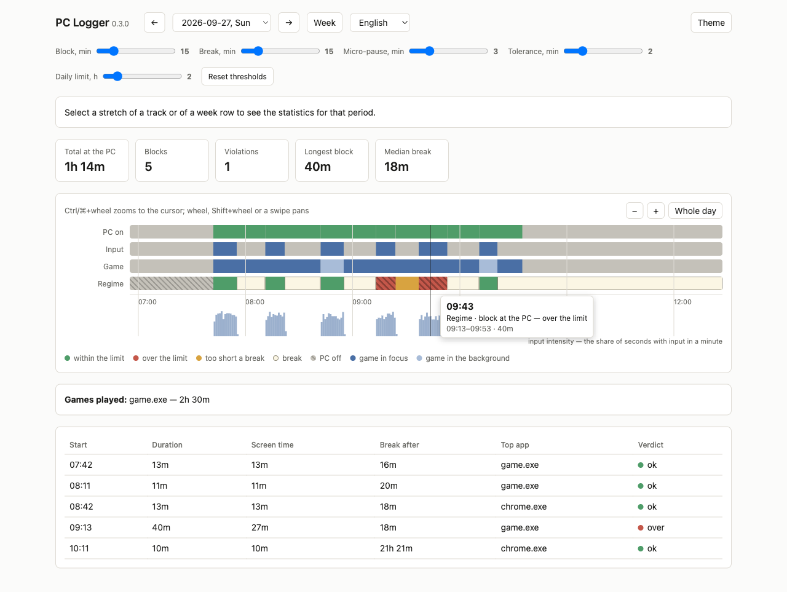
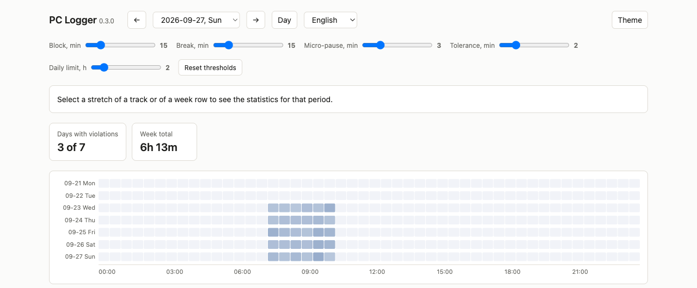

[Русский](README.ru.md)

# PC Logger

A small Windows tray app that tracks whether a “N minutes at the PC — N minutes break”
routine is actually being kept, and turns it into a local HTML report. Nothing leaves
the machine: no accounts, no network, no keystroke logging.

It was built for a simple household rule — play for a while, then take a real break —
and for being able to check afterwards how that went, without taking anyone's word for it.



## Contents

- [Features](#features)
- [Getting Started](#getting-started)
- [Installation](#installation)
- [Usage](#usage)
- [Configuration](#configuration)
- [Privacy and data](#privacy-and-data)
- [Limitations](#limitations)
- [Repository layout](#repository-layout)
- [Development](#development)

## Features

- **Records presence, not content.** Once per second: was there keyboard/mouse input,
  was there gamepad input, which app was in focus. Keystrokes are never read.
- **Splits the day into blocks and breaks.** A block ends only after a long enough pause
  in input, so a paused game left on screen still counts as a break.
- **Judges every block** against configurable thresholds and marks the ones over the limit.
- **Knows what was a game.** Point it at your game folders and a separate track shows
  when a game was in focus or running in the background.
- **Day and week views**, with zoom, drag-to-select statistics and a heatmap of the week.
- **Honest about gaps.** If the recorder crashed or stopped, the report says so instead of
  passing the silence off as a perfectly kept routine.
- **Self-contained.** A single folder with an exe; the .NET runtime is bundled.
  The report is a static HTML file that opens in any browser. English and Russian UI.

## Getting Started

1. Download `PcLogger-win-x64.zip` from the
   [latest release](https://github.com/navoznov/pc-logger/releases/latest) and unpack it.
2. Run `PcLogger.exe`. An icon appears in the system tray and recording starts right away.
3. *(Optional)* Tell it where your games live: tray icon → **Game folders**, add paths, save.
   See [Game folders](#game-folders).
4. *(Optional)* Make it start with Windows: `PcLogger.exe --install`.
   See [Auto-start](#auto-start).
5. Use the computer as usual. Later, click the tray icon → **Report** — the report opens
   in your browser.

## Installation

### Requirements

- Windows 10 or 11, x64.
- Nothing else: the .NET runtime is bundled, administrator rights are not needed.

### Unpack and run

Download `PcLogger-win-x64.zip` from the [releases page](https://github.com/navoznov/pc-logger/releases),
unpack it **whole** into any folder, and run `PcLogger.exe`.

The `dashboard` folder next to the exe is only needed if you want to change how the report
looks: files in it take priority, and a copy of them is built into the exe, so deleting
the folder breaks nothing.

### Auto-start

To start recording automatically at sign-in:

```
PcLogger.exe --install     # registers a task in Task Scheduler
PcLogger.exe --uninstall   # removes it
```

The task is created for the current user, so no administrator rights are needed. Run
`--install` from `PcLogger.exe` itself — under `dotnet run` the command refuses, because
Task Scheduler would get the path to `dotnet.exe` instead of the program.

The task is registered with no time limit and without stop-on-battery: Task Scheduler's
defaults would kill the recorder after three days of continuous running, and on a laptop
would keep it from starting at all.

### Updating and removing

To update, quit the app from the tray, replace the folder with the new release and start it
again — your data lives elsewhere and is kept. To remove the app, run
`PcLogger.exe --uninstall`, quit it, and delete the folder and, if you want the history gone
too, `%LOCALAPPDATA%\PcLogger`.

## Usage

### Tray menu

| Item | What it does |
|---|---|
| **Report** | Builds the HTML report and opens it in the browser |
| **Open data folder** | Opens `%LOCALAPPDATA%\PcLogger` — the database and the config |
| **Game folders** | Opens `config.json` in Notepad |
| **Quit** | Removes the icon and stops recording |

The version is shown at the top of the menu and in the report header.

### Reading the day view

Four tracks share one time axis:

```
PC on        ▓▓▓▓▓▓▓▓▓▓▓▓▓▓▓▓▓▓▓▓▓▓░░░░░░
Input        ░▓▓▓▓░░░░▓▓▓▓░░░░▓▓▓▓▓▓░░░░░
Game         ░████▒▒▒▒████▒▒▒▒██████░░░░░    █ in focus · ▒ in the background
Regime       [  ok  ][ break ][  ok  ]
```

- **PC on** — whether anything was recorded at all. Empty means the computer was off
  or asleep, not that nobody was at it.
- **Input** — whether there was input. No input while the PC is on reads as “stepped away”.
- **Game** — context only: it never affects the verdict.
- **Regime** — blocks and breaks. Blocks over the limit are hatched, not just coloured red.

Below the tracks is an input-intensity histogram, then the day's KPIs, the games played,
and a table of blocks with their verdicts.

What each threshold, KPI, track, legend colour and table column means is explained in the
tooltip of that element.

### Working with the report

- **Hover** over any track: a vertical line runs through all four, and a tooltip shows the
  time, what was in focus, whether there was input, and which block this is with its
  verdict and boundaries.
- **Drag-select** any stretch of a track, the time axis or the histogram to get statistics
  for that period below: time at the PC, time away split into “stepped away” and
  “PC was off”, percentages and the ratio. Clicking a row in the block table does the same
  for that block.
- **Zoom:** Ctrl+wheel (⌘+wheel, or pinch on a trackpad) zooms toward the cursor. The plain
  wheel, Shift+wheel or a horizontal swipe pans. The **−**, **+** and **Whole day** buttons
  do the same without a mouse. Zoom only affects the lane, the axis and the histogram — KPIs
  and the block table always cover the whole day. The closest zoom is ten minutes.
- **Thresholds:** the sliders at the top change the regime thresholds and recompute the
  verdict across the whole history at once, right in the browser. **Reset thresholds**
  restores the defaults.
- **Navigation:** ← and → page through days (or weeks in the week view). **Theme** toggles
  light/dark; the language picker switches between English and Russian. Both default to the
  system setting and are remembered in that browser.

### Week view

**Week** switches to a seven-day overview: days with violations, total screen time, a
heatmap of the week, and daily screen time against the daily limit. Click a heatmap row or a
day's bar to open that day; drag across a row to get statistics for that stretch.



### What counts as a break

A block is ended by the absence of input, not by switching windows. Pausing a game and
walking away is a break: the game window stays in front, but there is no input.

Pauses fall into three classes:

| Pause length | What happens |
|---|---|
| shorter than `micro_gap` (3 min) | absorbed into the block |
| from `micro_gap` up to `break_minutes` | the block goes on: too short to be a rest |
| `break_minutes` (15 min) or longer | the block closes, the break counts |

A block longer than `block` (15 min) plus `tolerance` (2 min) is marked as over the limit.
All of these are the report's sliders.

### When recording was interrupted

No data, on its own, means “the PC wasn't running” — the same as a quiet evening away from
the computer. So a broken recorder would look exactly like a perfectly kept routine.

To prevent that, the app records its own starts, stops and failures separately from the
presence data. If recording was interrupted on the selected day, the report shows a red banner
at the top with the time and the reason, the tray tooltip changes, and a notification pops up.
A gap under such a banner may not be rest. Failure details also go to `error.log` next to the
database.

## Configuration

### Game folders

`config.json` in the data folder (tray → **Game folders** opens it):

```json
{
  "game_folders": [
    "D:\\Steam\\steamapps\\common",
    "D:\\Games"
  ]
}
```

Any executable inside these folders counts as a game. The list is read **when the report is
built**, not while recording: add a folder, save, click **Report** — the game track is
repainted retroactively over the whole history, no restart needed.

A broken or empty config doesn't break the report: the game track just stays empty.

## Privacy and data

- Only the **fact** of input is recorded, never which keys were pressed. No low-level
  keyboard hook is used.
- Every ten seconds the app also notes which apps have visible windows — that is where the
  Game track comes from.
- Everything is stored locally in `%LOCALAPPDATA%\PcLogger\pclogger.db` (SQLite): ten-second
  buckets with the start time, how many of the ten seconds had input, how many had gamepad
  input, and which app was in focus; plus a table of app paths and the lifetimes of processes
  with windows.
- The report covers the last 90 days.
- The app makes no network connections.

## Limitations

What the app does approximately, or differently from what you might expect, is collected
in [docs/known-limitations.md](docs/known-limitations.md), with the reasons.

## Repository layout

```
src/
  PcLogger.Core/        platform-independent logic, builds anywhere
    Sampling/           per-second input/focus samples, window scanning
    Recording/          the recorder loop, start/stop/failure events
    Storage/            SQLite storage
    Model/              records shared by the layers above
    Reporting/          time spans, report JSON, rendering the HTML
    Config/             config.json and game folders
    Localization/       tray strings (EN/RU)
    dashboard/          the report UI: HTML template and plain JS (regime and
                        verdicts, drawing, selection, i18n), no build step
  PcLogger.App/         the Windows tray app (WinForms + Win32 calls)
tests/
  PcLogger.Core.Tests/  xUnit tests for Core
  dashboard/            node:test tests for the dashboard JS
tools/
  DemoReport/           builds a report from a week of synthetic data
docs/
  known-limitations.md  known limitations and why
  superpowers/          design specs and implementation plans
```

## Development

You need the [.NET 8 SDK](https://dotnet.microsoft.com/download/dotnet/8.0) and Node.js
(only for the dashboard tests).

```
dotnet test tests/PcLogger.Core.Tests    # Core tests
npm test                                 # dashboard tests
dotnet run --project tools/DemoReport    # build a report from synthetic data
```

`DemoReport` prints the path of the generated `report.html` — that is the fastest way to
work on the dashboard, and it runs on macOS and Linux too. The screenshots above were
made from it.

`PcLogger.Core` has no Windows dependencies. `PcLogger.App` targets `net8.0-windows`, but
thanks to `EnableWindowsTargeting` it also publishes from macOS:

```
dotnet publish src/PcLogger.App -c Release -r win-x64 --self-contained true \
  -p:PublishSingleFile=true -p:IncludeNativeLibrariesForSelfExtract=true
```
